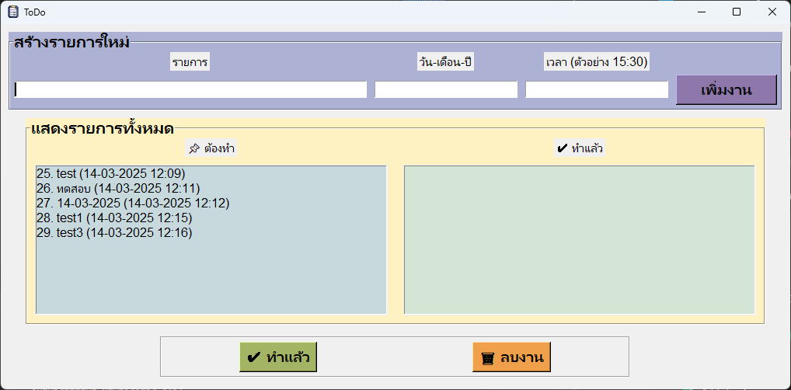

# 📌 Project Name: ToDo  

This is a simple To-Do application built with Python using Tkinter for the GUI.  

## 🚀 How It Works  
This app functions like a digital post-it note, allowing you to:  
- Add new tasks  
- Mark tasks as done  
- Delete tasks  

No more paper clutter!  

## 🛠 Installation & Setup
1.clone this repository
2.create environment (depend on you)
3.install module need (apscheduler, datetime, sqlite3)  > pip install ...
4.run >  py main.py
## create as .exe
1.pip install pyinstaller
2.run > pyinstaller --onefile --windowed --icon=icon.ico --name="ToDo"  main.py

*if run on environment notification it's work